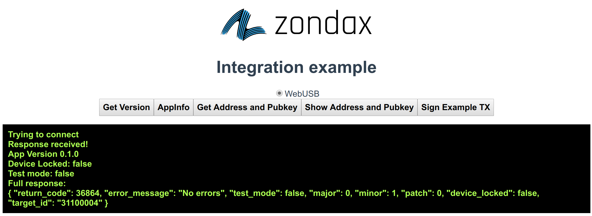

# ledger-filecoin-js

[]

This package provides a basic client library to communicate with the Filecoin App running in a Ledger Nano S/X

We recommend using the npmjs package in order to receive updates/fixes.

This repo also includes a simple Vue example for WebUSB.

